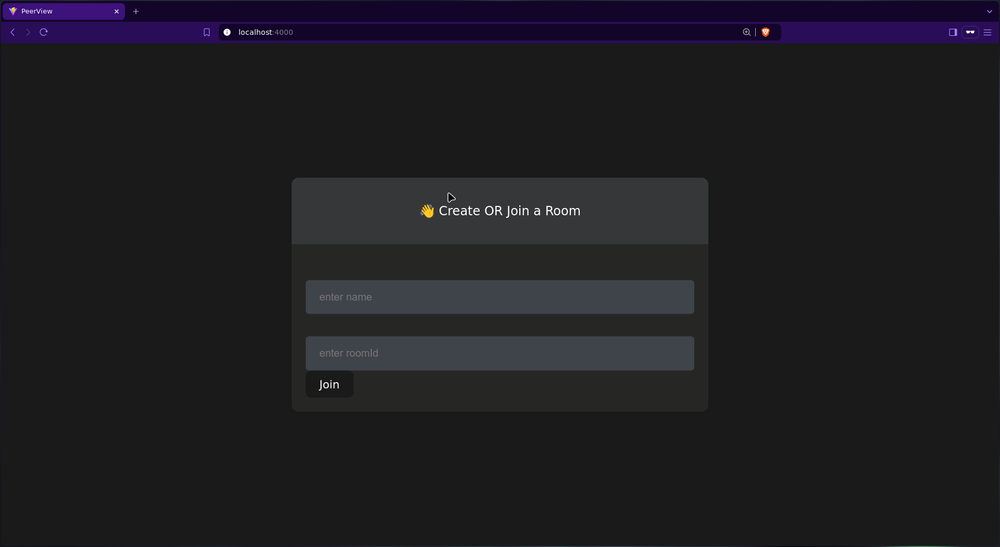
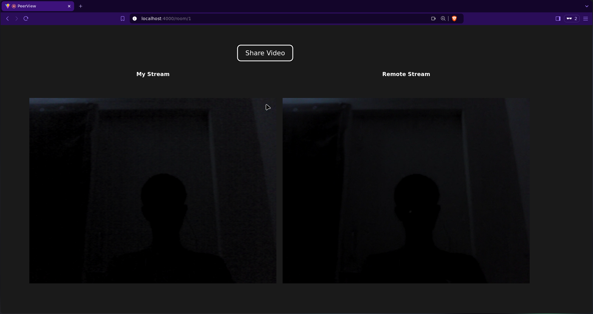

# PeerView

PeerView is a real-time video calling application built with React.js and WebSockets. Users can join rooms and engage in video calls with others in the same room.

## Features

- **Lobby**: Users enter their name and a room ID to join a room.
- **Video Calling**: Users in the same room can video call each other in real-time.

## Folder Structure

```
PeerView/
│
├── src/
│   ├── pages/
│   │   ├── lobby/         # Lobby page for entering name and room ID
│   │   └── room/          # Room page for video calling
│   │
│   ├── context/
│   │   └── socketProvider # Socket.io-client for managing WebSocket connections
│   │
│   ├── services/
│   │   └── peer.js        # RTC peer connection configuration
│   │
│   └── ...                # Other React boilerplate files
│
└── server.js              # WebSocket server
```

## Demo




## Installation

1. Clone the repository:

   ```bash
   git clone https://github.com/Revanth686/PeerView.git
   cd PeerView
   ```

2. Create a `.env` file in the root directory and add the following:

   ```bash
   VITE_APP_BACKEND_URL=http://localhost:4000
   ```

   Replace `http://localhost:4000` with your backend URL if necessary.

3. Install dependencies:

   ```bash
   npm install
   ```

4. Build the app:

   ```bash
   npm run build
   ```

5. Start the application:

   ```bash
   npm start
   ```

6. Open your browser and navigate to `http://localhost:4000`.

## Usage

1. **Join a Room**:

   - Navigate to the `/lobby` page.
   - Enter your name and a room ID to join.

2. **Video Call**:
   - After joining, you'll be redirected to `/room/:roomId`, where you can video call others in the same room.
